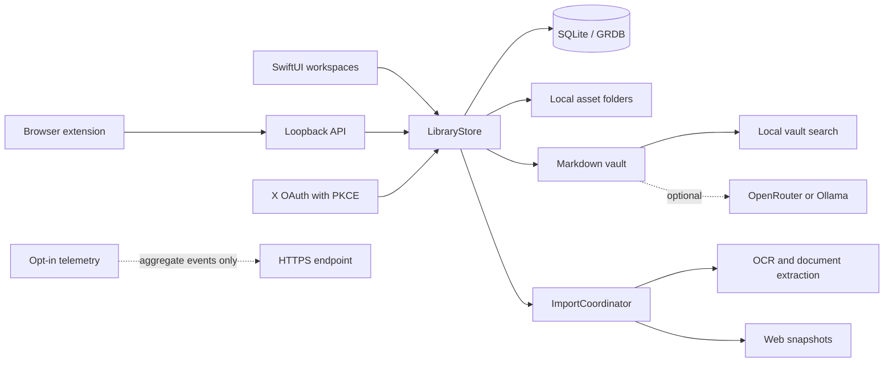

# Architecture

Loci is a native macOS application built with SwiftUI, AppKit, Swift Package Manager, SQLite, and GRDB. It is designed around one constraint: the user's library remains useful without an account, hosted backend, or LLM provider.

## System Overview



Solid lines represent local data flow. Dashed lines represent optional external services.

## Core Boundaries

### Application shell

`LociApp.swift` owns the macOS lifecycle, menus, windows, and top-level service startup. `ContentView.swift` composes the primary workspaces and application navigation.

### Library state

`LibraryStore` in `Models.swift` is the main observable application model. It owns the in-memory reference projection, selection and workspace state, import orchestration, and targeted updates published by database observation.

Views should read the narrowest state they need. Expensive file, database, image, and extraction work must stay outside SwiftUI `body` evaluation.

### Persistence

`PersistentStore.swift` owns the SQLite schema and durable records. GRDB observations in `TableObserver.swift` publish table-scoped changes so the model can reload affected references instead of decoding the entire library after every write.

Large source payloads remain in the database. The live UI keeps `XBookmarkPayloadSummary` projections rather than full browser-extension HTML and transcript payloads.

### Assets and libraries

The default library lives under:

```text
~/Library/Application Support/Loci
```

Originals, thumbnails, the SQLite database, generated Markdown, and import staging files are stored below the selected library root. Folder-backed libraries may be placed in a user-selected local or cloud-synced folder, but provider conflict resolution remains outside Loci's control.

### Import pipeline

`ImportCoordinator` serializes queued import work. Imports can originate from files, URLs, screenshots, pasteboard contents, the browser extension, X sync, or the local API. Follow-up jobs generate previews, extract text, and update the Markdown vault.

Import results are delivered through an asynchronous stream. There is no idle UI polling timer.

### Rendering

Grid surfaces use lazy containers. Canvas and Infinity surfaces calculate item positions in screen space and cull tiles outside a buffered viewport. `LociImageLoader` bounds image decoding and thumbnail work.

Shared visual constants live in `LociDesign.swift`, `AppMotion.swift`, and `AppBrand.swift`. Authored type sizes use a shared `@ScaledMetric` modifier so Dynamic Type can scale text and symbol geometry.

## External Boundaries

### Browser extension and local API

The WebExtension sends captures to `127.0.0.1:17641`. The server is loopback-only unless remote access is explicitly enabled. Protected routes require a bearer token, request bodies are bounded, and allowed origins are restricted.

### X OAuth

X sync uses OAuth 2.0 with PKCE. Access and refresh tokens are stored in the macOS Keychain. Legacy key names remain in the source only to migrate existing development installations safely.

### LLM providers

LLM assistance is optional. Local vault search remains available without it. When a user configures an external provider, selected source context may leave the Mac; prompts and responses are excluded from telemetry.

### Telemetry

Telemetry is disabled by default. Its implementation allowlists aggregate property names and rejects non-HTTPS upload endpoints. See [Telemetry and Privacy](TELEMETRY_AND_PRIVACY.md) for the data contract.

## Data Ownership Rules

Changes must preserve these invariants:

1. Core capture, browsing, and local search work without a hosted account.
2. Raw user content never enters telemetry.
3. Credentials and OAuth tokens never enter the library database or source tree.
4. External network use is explicit and attributable to a configured integration.
5. Database and filesystem migrations preserve existing libraries.

## Verification

The baseline contributor checks are:

```sh
swift build
swift test
```

High-risk changes should also exercise the relevant boundary manually:

- Persistence: fresh library, existing library, deletion, and migration.
- Import: malformed input, duplicates, cancellation, and large batches.
- UI: empty, loading, error, long-content, Dynamic Type, and dark appearances.
- Local API: authorization, CORS, body limits, and loopback binding.
- OAuth: state validation, refresh, cancellation, and Keychain persistence.
- Telemetry: disabled default, allowlist enforcement, queue clearing, and HTTPS-only upload.
